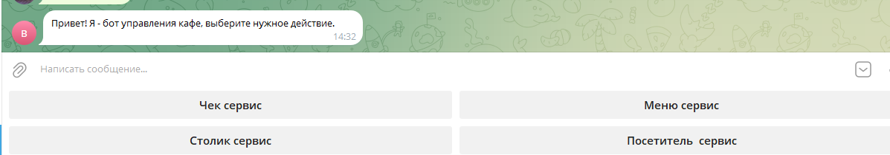

# PortfolioWpf

Привет! Меня зовут Юля. Я начинающий разработчик C# Backend. Этот репозиторий содержит приложение, которое я разработала, изучая различные стороны программирования на C#.

### Телеграмм бот для бронирования столиков кафе (первый проект)

**Описание:**
Возможность создавать столики, добавлять посетителя, управлять бронированием, добавить блюда в счет и получать чек

